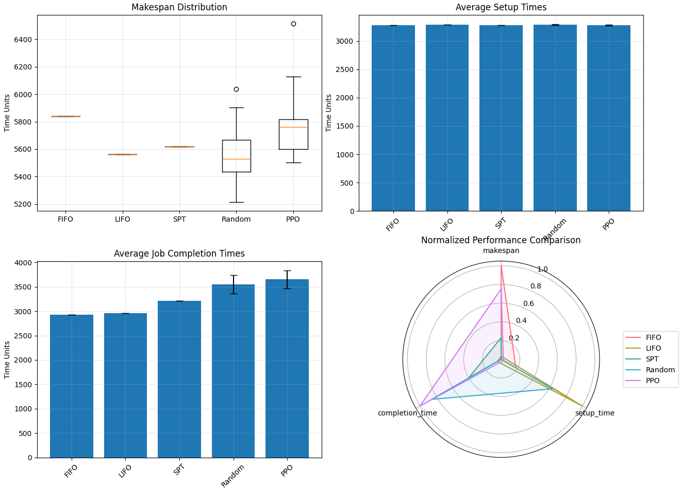

# Erklärung der Job-Scheduling-Vergleichsdiagramme

Die vier Diagramme zeigen einen Vergleich verschiedener Job-Scheduling-Methoden: FIFO (First In, First Out), LIFO (Last In, First Out), SPT (Shortest Processing Time), Random und PPO (Proximal Policy Optimization, eine Reinforcement Learning-Methode).

## 1. Makespan Distribution (Oben links)

**Was es zeigt:** Die Verteilung der Gesamtfertigstellungszeit (Makespan) für alle Jobs.

**Einfache Erklärung:**
- Ein Boxplot für jede Methode zeigt, wie lange es dauert, bis alle Jobs abgeschlossen sind
- Kürzere Balken sind besser (weniger Zeit bis zur Fertigstellung)
- LIFO und SPT haben die niedrigsten und konsistentesten Makespan-Werte
- PPO zeigt eine größere Streuung mit einigen Ausreißern (Punkte über der Box)
- FIFO hat einen vergleichsweise hohen, aber konstanten Makespan
- Random hat eine mittlere Performance mit breiter Streuung

**Fazit:** LIFO und SPT scheinen am effizientesten bezüglich der Gesamtfertigstellungszeit zu sein.

## 2. Average Setup Times (Oben rechts)

**Was es zeigt:** Die durchschnittliche Zeit, die für das Umrüsten der Maschinen zwischen verschiedenen Jobs benötigt wird.

**Einfache Erklärung:**
- Alle Methoden haben ähnlich hohe Setup-Zeiten (ca. 3000 Zeiteinheiten)
- Die kleinen Fehlerbalken zeigen, dass diese Werte über verschiedene Durchläufe sehr stabil sind
- Keine Methode hat einen klaren Vorteil bei der Reduzierung von Setup-Zeiten

**Fazit:** Bei den Setup-Zeiten gibt es kaum Unterschiede zwischen den Methoden.

## 3. Average Job Completion Times (Unten links)

**Was es zeigt:** Die durchschnittliche Zeit, die benötigt wird, bis ein einzelner Job fertig ist.

**Einfache Erklärung:**
- FIFO und LIFO haben die niedrigsten durchschnittlichen Fertigstellungszeiten (ca. 3000 Zeiteinheiten)
- SPT liegt in der Mitte
- Random und PPO haben deutlich höhere Fertigstellungszeiten (ca. 3500-3600 Zeiteinheiten)
- Die Fehlerbalken zeigen, dass PPO und Random auch mehr Variabilität aufweisen

**Fazit:** FIFO und LIFO scheinen für die schnelle Fertigstellung einzelner Jobs am besten zu sein, was wichtig sein kann, wenn Kunden auf ihre Bestellungen warten.

## 4. Normalized Performance Comparison (Unten rechts)

**Was es zeigt:** Ein Radar-Chart, das alle drei Metriken normalisiert und auf einer Skala von 0-1 vergleicht.

**Einfache Erklärung:**
- Jede Achse repräsentiert eine Metrik: Makespan, Setup-Zeit und Fertigstellungszeit
- Näher am Mittelpunkt ist besser (niedrigere Werte)
- PPO (violett) hat den schlechtesten Makespan
- LIFO (gelb) hat hervorragende Werte bei Setup-Zeit und Fertigstellungszeit
- FIFO (rot) ist gut bei Fertigstellungszeit, aber schlecht beim Makespan
- SPT (grün) bietet eine ausgewogene Performance über alle Metriken

**Fazit:** Die Wahl der Methode hängt davon ab, welche Metrik für den spezifischen Anwendungsfall am wichtigsten ist.

## Gesamtanalyse

Nach der Betrachtung aller Diagramme:

1. **LIFO** scheint insgesamt am effizientesten zu sein, besonders für kurze Durchlaufzeiten und Fertigstellungszeiten.

2. **SPT** bietet eine gute Balance zwischen allen Metriken.

3. **FIFO** ist gut für vorhersehbare Fertigstellungszeiten einzelner Jobs, aber nicht optimal für die Gesamteffizienz.

4. **Random** zeigt mittelmäßige Performance mit hoher Variabilität.

5. **PPO** (der Reinforcement-Learning-Ansatz) zeigt überraschenderweise nicht die beste Performance, was darauf hindeutet, dass entweder:
   - Das Modell noch nicht ausreichend trainiert wurde
   - Die Reward-Funktion nicht optimal gestaltet ist
   - Einfache Heuristiken für dieses spezifische Problem bereits sehr effizient sind

Diese Analyse hilft bei der Entscheidung, welche Scheduling-Methode für bestimmte Produktionsumgebungen am besten geeignet ist, je nachdem ob die Priorität auf der Gesamtdurchlaufzeit (Makespan), minimalen Setup-Zeiten oder schneller Fertigstellung einzelner Jobs liegt.